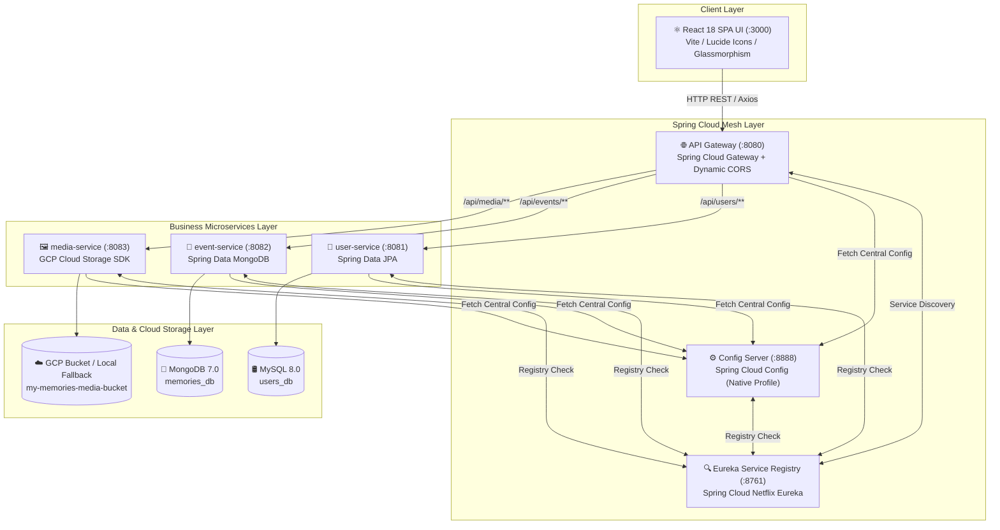

# ☁️ My Memories — Cloud Microservices & React SPA Platform

<div align="center">


<p align="center">
  <b>A state-of-the-art Polyrepo-ready Microservices Web Application for logging personal memories, uploading media to Google Cloud Storage, and managing profiles.</b>
</p>

[Architecture](#-system-architecture) • [Features](#-key-features) • [Services](#-microservices--ports) • [Quickstart](#-getting-started) • [API Routes](#-api-endpoints)

</div>

---

## 🏛 System Architecture



---

## ✨ Key Features

| Feature | Description | Tech Stack |
| :--- | :--- | :--- |
| **🔒 Auth Barrier & Session** | Protected Sign In & Sign Up pages. Dashboard unlocks only for authenticated sessions. | React State, LocalStorage, MySQL User Query |
| **👤 User Profile Management** | Full user registration & listing managed by MySQL Relational Database. | Spring Data JPA, MySQL 8.0 |
| **📅 Complete Events CRUD** | Full Create, Read, Update (Edit Modal), and Delete operations for memory events. | Spring Data MongoDB, MongoRepository |
| **☁️ GCP Media Uploader** | Multipart image file uploader backed by Google Cloud Storage SDK + local disk fallback. | `com.google.cloud:google-cloud-storage` |
| **🌐 Dynamic Routing & CORS** | Centralized API Gateway dynamically routing `/api/users/**`, `/api/events/**`, and `/api/media/**`. | Spring Cloud Gateway |
| **🔍 Service Registry** | Live microservices registration & discovery dashboard. | Netflix Eureka Server (`:8761`) |
| **⚙️ Centralized Config** | Native profile Config Server reading properties from `classpath:/config`. | Spring Cloud Config (`:8888`) |
| **🎨 Glassmorphism React UI** | Rich UI with ambient glow animations, dark/light theme, custom delete modals, and toast alerts. | React 18, Vite, CSS Design System |

---

## 📦 Microservices & Ports

| Module | Service Name | Port | Database / Storage | Description |
| :--- | :--- | :--- | :--- | :--- |
| **`eureka_server`** | Eureka Registry | `8761` | In-Memory Registry | Central Service Discovery Dashboard |
| **`config-server`** | Config Server | `8888` | Classpath Native Config | Centralized Configuration Provider |
| **`api-gateway`** | API Gateway | `8080` | Dynamic Route Locator | Entry point & Global CORS Handler |
| **`user-service`** | User Microservice | `8081` | MySQL (`users_db`) | User Profiles CRUD |
| **`event-service`** | Event Microservice | `8082` | MongoDB (`memories_db`) | Memory Events CRUD |
| **`media-service`** | Media Microservice | `8083` | GCP Cloud Storage Bucket | Image Uploads & File URL Resolution |
| **`frontend`** | React SPA | `3000` | Browser Application | Glassmorphism Web Interface |

---

## 🚀 Getting Started

### Option 1: Docker Compose (Single Command Run)
Run the entire architecture (MySQL, MongoDB, Eureka, Config Server, Gateway, Microservices, & React UI):
```bash
docker-compose up --build
```

### Option 2: Running Microservices Standalone

1. **Start Eureka Registry Server**:
   ```bash
   cd eureka_server
   .\mvnw.cmd spring-boot:run
   ```
2. **Start Spring Cloud Config Server**:
   ```bash
   cd config-server
   .\mvnw.cmd spring-boot:run
   ```
3. **Start API Gateway**:
   ```bash
   cd api-gateway
   .\mvnw.cmd spring-boot:run
   ```
4. **Start Business Microservices**:
   ```bash
   # User Service (Port 8081)
   cd user-service && .\mvnw.cmd spring-boot:run

   # Event Service (Port 8082)
   cd event-service && .\mvnw.cmd spring-boot:run

   # Media Service (Port 8083)
   cd media-service && .\mvnw.cmd spring-boot:run
   ```

### Option 3: Running React SPA UI
```bash
cd frontend
npm install
npm run dev
```
Open **`http://localhost:3000`** in your browser.

---

## 📡 API Endpoints

### 👤 User Service (`/api/users/**`)
- `GET /api/users` — Retrieve all user profiles from MySQL.
- `POST /api/users` — Create a new user profile (`{ "name": "...", "email": "..." }`).
- `GET /api/users/{id}` — Get user details by ID.

### 📅 Event Service (`/api/events/**`)
- `GET /api/events` — Retrieve all memory events from MongoDB.
- `POST /api/events` — Create a memory event (`{ "userId": 1, "title": "...", "eventDate": "...", "location": "..." }`).
- `PUT /api/events/{id}` — Update an existing memory event.
- `DELETE /api/events/{id}` — Delete a memory event from MongoDB.
- `PATCH /api/events/{id}/images` — Attach image URL to memory event.

### 🖼️ Media Service (`/api/media/**`)
- `POST /api/media/upload` — Upload image file (`MultipartFile file`, `eventId`) to GCP Cloud Storage.
- `GET /api/media/files/{filename}` — Download/view local media asset fallback.

---

## 📁 Repository Structure

```
d:\My_Memories\
├── eureka_server\           # Netflix Eureka Service Registry (:8761)
├── config-server\           # Spring Cloud Config Server (:8888)
│   └── src\main\resources\config\  # Centralized YAML Configs
├── api-gateway\             # Spring Cloud Gateway (:8080)
├── user-service\            # MySQL User Microservice (:8081)
├── event-service\           # MongoDB Event Microservice (:8082)
├── media-service\           # GCP Storage Media Microservice (:8083)
├── frontend\                # React 18 + Vite Single Page Application (:3000)
│   ├── src\
│   │   ├── components\      # Auth, Gallery, Edit Modal, Media Uploader, Status Bar
│   │   ├── services\        # Axios API Gateway integration
│   │   └── App.jsx
│   ├── Dockerfile
│   └── package.json
├── docker-compose.yml       # Full Stack Orchestration
└── README.md
```

---

<div align="center">
  <sub>Built with ❤️ using Spring Cloud, Java 21, React 18, and Google Cloud Storage.</sub>
</div>
